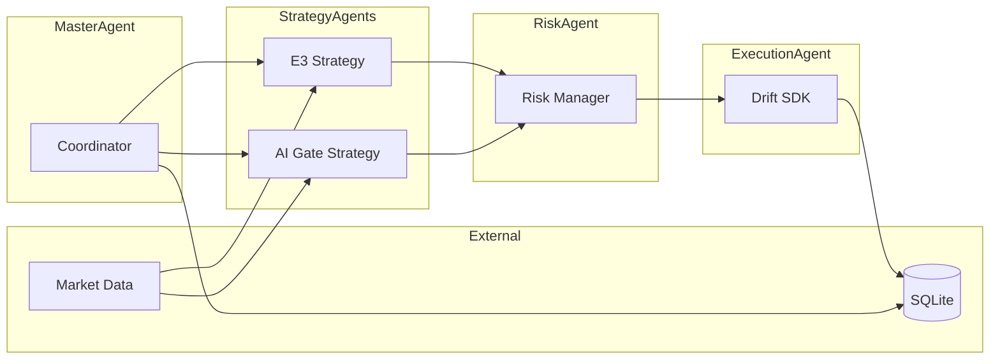
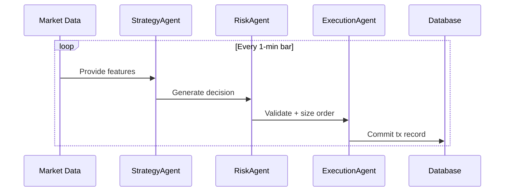

# Architecture Guide

## Updated System Architecture (v0.1.1)
1. **Market Data (`marketData.ts`)**
   - Extracts features: bodyOverAtr, volumeZ, obImbalance, premiumPct.
   - Now enriched with fundingRate, openInterest, realizedVol, spreadBps.

2. **Baseline Strategy (`strategy/e3.ts`)**
   - Applies profitability-focused rules using configurable thresholds (`CONFIG.thresholds`).
   - Produces trigger + side decision with reasons[] explaining trade logic.

3. **AI Layer (`aiGate.ts`)**
   - Sends enriched feature context to Ollama LLM.
   - Returns decision + confidence, along with prompt and raw response (audited in DB).

4. **Risk (`risk.ts`)**
   - Daily loss cap, cooldown, position sizing, adaptive logic.

5. **Execution (`drift.ts`)**
   - Places perps IOC orders on Drift Protocol.
   - Slippage management via config.

6. **Database (`db.ts`)**
   - Logs signals, orders, trades, PnL.
   - Audit fields: prompt, raw LLM responses tied to each decision.

## Design Principle
- **Hybrid Architecture**: Rule-based baseline ensures stable profit-seeking trades; LLM acts as a filter/confirmation layer.
- **Traceability**: Every feature, decision, and LLM response logged for audit and iterative optimization.

This document defines the high-level system architecture for the trading automation platform.

---

## Purpose & Non-Goals
**Purpose**: Describe the major system components, their responsibilities, and how they interact.  
**Non-Goals**: Implementation details, performance optimizations, or low-level SDK code.

---

## System Overview

---

## Agents & Responsibilities

- **MasterAgent**
  - Spawns and coordinates specialized agents
  - Maintains runtime state
  - Manages persistence and telemetry hooks

- **Strategy Agents**
  - Input: Market features, account state
  - Output: Trading decisions (`Signal`, `Decision`)
  - Includes:
    - E3 strategy
    - AI-based strategy gate

- **Risk Agent**
  - Input: Trading decisions + account balances
  - Output: Permit/deny + adjusted order size
  - Enforces caps, cooldowns, and circuit breakers

- **Execution Agent**
  - Input: Verified order request
  - Output: Transaction result
  - Interfaces with Drift SDK / blockchain

---

## Runtime Loop

---

## Data & Persistence
- SQLite tables:
  - `signals` (strategy decisions + confidence)
  - `orders` (requests issued, status, txid)
  - `risk_checks` (results from validator)
- Future: telemetry and metrics table

---

## Configuration
- `.env` variables mapped via `config.ts`
  - Exchange keys
  - Risk thresholds
  - Strategy flags

---

## Observability
- Logs at each agent boundary
- Metrics roadmap:
  - Latency per pipeline stage
  - Success/failure rates
  - Risk rejections count

---

## Risks & Safeguards
- Default fail-closed on anomalies
- Reduce-only safeguards during error periods
- Caps on order size and exposure

---

## Roadmap
- **Near-term**: Exit management, L2 volume signals
- **Mid-term**: Funding filters for strategies
- **Long-term**: Backtesting and simulation framework
