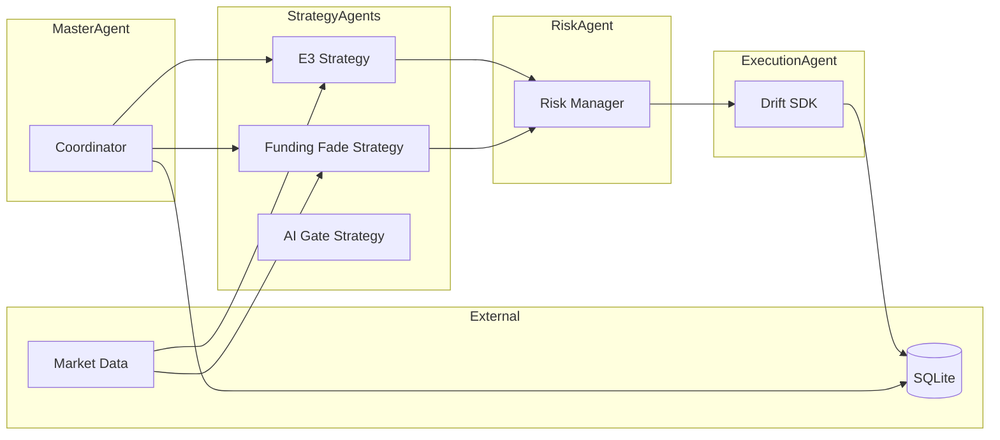
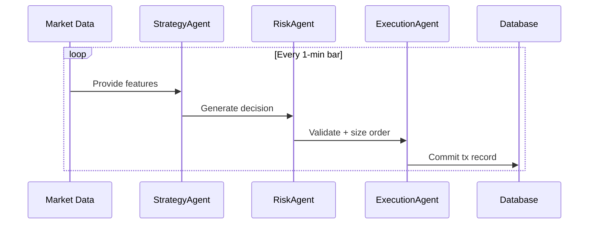

# Architecture Guide

## Aug 2025 Update
- **Memory-Efficient Optimizer (v0.6.5)**: Completely refactored `src/optimize.ts` to solve memory issues that prevented comprehensive parameter sweeps. Implemented chunked processing (configurable chunk sizes), progress tracking with resumption capability, garbage collection monitoring, and memory usage logging. Added new npm scripts with increased memory allocation and garbage collection flags. Successfully tested 48 parameter sets without crashes, enabling systematic discovery of optimal profitable parameters.
- **E3 Strategy Critical Fix (v0.6.4)**: Fixed major logic bug in `src/strategy/e3.ts` where `shouldEnter` method was not properly evaluating all conditions. The strategy was always triggering regardless of volume Z-score, order book imbalance, or funding rate thresholds. After fix: strategy now generates 60,000+ realistic trades over 7+ months with profitable parameter sets achieving +4.39 PnL.
- **Strategy Layer**: E3 baseline moved into **high-trade mode** for testing backtest infrastructure.
- **Backtest Regimes**: Regime classifier (`regimes.ts`) confirmed wired into backtest loop; metrics breakdown placeholder logs regimes for each tick.
- **Pipeline Fixes**: Backtest equity curve logging patched to avoid NaN values, all trades now priced correctly.
- **Roadmap**: Overlay regimes in `visualize.ts`, introduce Funding & Premium Skew Fade strategy, and integrate AI for parameter tuning across 2023–2025 tests.

## Updated System Architecture (v0.1.1)
1. **Market Data (`marketData.ts`)**
   - Extracts features: bodyOverAtr, volumeZ, obImbalance, premiumPct.
   - Now enriched with fundingRate, openInterest, realizedVol, spreadBps.

2. **Strategies**
   - **E3 (`strategy/e3.ts`)**: Profitability-focused rules using configurable thresholds (`CONFIG.thresholds`). **Fixed in v0.6.4**: Corrected `shouldEnter` logic to properly evaluate all conditions instead of always triggering. Now generates realistic trade volumes with profitable parameter sets. Produces trigger + side decision with reasons[] explaining trade logic.
   - **Funding Fade (`strategy/fundingFade.ts`)**: Fades extremes in fundingRate + premiumPct, with filters on spread and volume. Integrated as of v0.6.1.
   - **Optimizer Parameter Injection (v0.6.3)**: During optimization and backtests, parameter sets are injected into `(global as any).CONFIG.thresholds`. This enables dynamic strategy calibration for:
     - E3: `bodyOverAtr`, `volumeZ`, `premiumPct`, `realizedVol`, `spreadBps`.
     - Funding Fade: `fundingRate`, `premiumPct`, `spreadBps`, `volumeZ`.
     - Backwards compatibility maintained via `thresholds` object in `config.ts`.

3. **AI Layer (`aiGate.ts`)**
   - Sends enriched feature context to Ollama LLM.
   - Returns decision + confidence, along with prompt and raw response (audited in DB).

4. **Risk (`risk.ts`)**
   - Daily loss cap, cooldown, position sizing, adaptive logic.

5. **Execution (`drift.ts`)**
   - Places perps IOC orders on Drift Protocol.
   - Slippage management via config.

6. **Database (`db.ts`)**
   - Logs signals, orders, trades, PnL.
   - Audit fields: prompt, raw LLM responses tied to each decision.

## Design Principle
- **Hybrid Architecture**: Rule-based baseline ensures stable profit-seeking trades; LLM acts as a filter/confirmation layer.
- **Traceability**: Every feature, decision, and LLM response logged for audit and iterative optimization.

## Memory Optimization Implementation (v0.6.5)
The optimizer was completely refactored to handle large-scale parameter sweeps without memory crashes:

**Key Features:**
- **Chunked Processing**: Configurable batch sizes (default: 5 parameter sets per chunk)
- **Progress Persistence**: Saves results after each chunk to `progress_*.json` files
- **Memory Monitoring**: Logs heap usage and forces garbage collection between chunks
- **Resumption Capability**: Can resume interrupted optimizations from saved progress
- **Enhanced npm Scripts**: `optimize:memory` with `--max-old-space-size=4096` and `--expose-gc`

**Technical Implementation:**
- `chunkArray()` function splits parameter sets into manageable batches
- `forceGC()` function monitors memory usage and triggers garbage collection
- Progress files include timestamp, completion status, and all intermediate results
- Configurable via `chunkSize` and `saveProgress` in optimization config files

This enables comprehensive parameter optimization for maximum profitability discovery.

This document defines the high-level system architecture for the trading automation platform.

---

## Purpose & Non-Goals
**Purpose**: Describe the major system components, their responsibilities, and how they interact.  
**Non-Goals**: Implementation details, performance optimizations, or low-level SDK code.

---

## System Overview

---

## Agents & Responsibilities

- **MasterAgent**
  - Spawns and coordinates specialized agents
  - Maintains runtime state
  - Manages persistence and telemetry hooks

- **Strategy Agents**
  - Input: Market features, account state
  - Output: Trading decisions (`Signal`, `Decision`)
  - Includes:
    - E3 strategy
    - AI-based strategy gate

- **Risk Agent**
  - Input: Trading decisions + account balances
  - Output: Permit/deny + adjusted order size
  - Enforces caps, cooldowns, and circuit breakers

- **Execution Agent**
  - Input: Verified order request
  - Output: Transaction result
  - Interfaces with Drift SDK / blockchain

---

## Runtime Loop

---

## Data & Persistence
- SQLite tables:
  - `signals` (strategy decisions + confidence)
  - `orders` (requests issued, status, txid)
  - `risk_checks` (results from validator)
- Future: telemetry and metrics table
- **Drift Data Provider (v0.4.2 update)**:
  - Aggregates Drift S3 trade/funding data into candles.
  - `safeParseFile` now accepts trades with minimal required fields (`price` + timestamp).
  - Optional fields tolerated (`side`, `maker`, `taker`, etc.).
  - Structured logs output counts per-file: parsed, accepted, skipped, malformed.
  - Robust to malformed lines; skips noise-only entries gracefully.

---

## Configuration
- `.env` variables mapped via `config.ts`
  - Exchange keys
  - Risk thresholds
  - Strategy flags

---

## Observability
- Logs at each agent boundary
- Metrics roadmap:
  - Latency per pipeline stage
  - Success/failure rates
  - Risk rejections count

---

## Risks & Safeguards
- Default fail-closed on anomalies
- Reduce-only safeguards during error periods
- Caps on order size and exposure

---

## Roadmap
- **Phase 1**: Strategy enhancement & diversification (implement Funding Fade, optimize E3 thresholds)
- **Phase 2**: AI-powered intelligence (enhanced Ollama prompts, automated parameter tuning)
- **Phase 3**: Advanced risk management (Kelly sizing, ATR-based stops, portfolio allocation)
- **Phase 4**: Robust backtest-to-live pipeline (walk-forward, Monte Carlo, live micro-deployment)
- **Phase 5**: Scaling & advanced features (market microstructure analysis, multi-market expansion)

Reference [PROFITABILITY_ROADMAP.md](./PROFITABILITY_ROADMAP.md) for comprehensive implementation detail.
